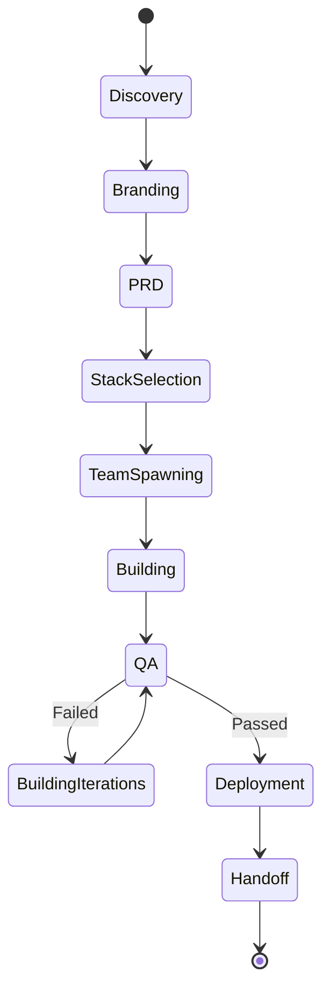

# Project Creator Agent - Technical Specification

## 🎯 Overview

The **Project Creator Agent** is a specialized autonomous agent within Agentik OS responsible for orchestrating the entire project creation workflow, from initial idea to working MVP.

## 🧠 Agent Profile

| Property | Value |
|----------|-------|
| **Name** | Project Creator Agent |
| **Model** | Claude Opus 4.6 (primary), Sonnet 4.5 (fallback) |
| **Type** | Orchestrator + Coordinator |
| **Autonomy Level** | High (90% autonomous) |
| **User Intervention** | Approval gates only |
| **Cost per Project** | $3-10 (depending on complexity) |

## 📋 Responsibilities

### 1. Discovery & Requirements Gathering

**What it does:**
- Conducts conversational interview with user
- Asks strategic questions to clarify vision
- Identifies MVP scope and must-have features
- Documents user intent and constraints

**Questions asked:**
```
1. What problem are you solving?
2. Who are your target users?
3. What are the 3 core features?
4. What's your business model?
5. Any technical constraints? (existing systems, APIs, etc.)
6. Timeline expectations?
7. Budget for AI costs?
```

**Output:** `PROJECT_DISCOVERY.json`

```json
{
  "projectName": "TaskFlow",
  "problem": "Freelancers waste time on manual invoicing",
  "targetUsers": ["Freelancers", "Small agencies"],
  "coreFeatures": [
    "Time tracking",
    "Automatic invoice generation",
    "Payment tracking"
  ],
  "businessModel": "Freemium + Pro ($19/mo)",
  "constraints": {
    "mustIntegrateWith": ["Stripe", "QuickBooks"],
    "deadline": "2 weeks for MVP",
    "budget": "$50 for AI costs"
  }
}
```

### 2. Branding & Identity

**What it does:**
- Generates 5 product name suggestions
- Creates emotional positioning statement
- Designs 3 color palette options (oklch)
- Proposes logo concepts (text-based)

**Output:** `BRANDING.json`

```json
{
  "productNames": [
    "TaskFlow",
    "InvoiceEase",
    "FreelanceHub",
    "BillTracker",
    "WorkSync"
  ],
  "selectedName": "TaskFlow",
  "positioning": "The stress-free way to track time and get paid faster",
  "colorPalettes": [
    {
      "name": "Professional Blue",
      "primary": "oklch(0.55 0.15 250)",
      "secondary": "oklch(0.45 0.12 245)",
      "accent": "oklch(0.65 0.18 180)"
    }
  ],
  "selectedPalette": "Professional Blue"
}
```

### 3. PRD Generation

**What it does:**
- Creates comprehensive Product Requirements Document
- Defines user stories with acceptance criteria
- Sets success metrics (AARRR framework)
- Documents technical requirements
- Generates API contracts (if needed)

**Output:** `PRD.md` (full document)

Includes:
- Executive Summary
- User Personas (2-3)
- Feature Specifications (detailed)
- User Stories (10-20)
- Technical Architecture
- Success Metrics
- Risks & Mitigation

### 4. Stack Selection & Justification

**What it does:**
- Analyzes requirements (real-time? auth? payments? etc.)
- Compares stack options (Next.js vs React, Convex vs Supabase)
- Considers: scalability, cost, team expertise, deployment speed
- Recommends optimal stack with reasoning
- Provides alternatives with trade-offs

**Output:** `STACK_SELECTION.json`

```json
{
  "recommended": {
    "frontend": "Next.js 16 (App Router)",
    "backend": "Convex",
    "auth": "Clerk",
    "payments": "Stripe",
    "ui": "shadcn/ui + Tailwind CSS",
    "deployment": "Vercel",
    "database": "Convex (built-in)",
    "reasoning": "Real-time updates required (time tracking), rapid development, integrated deployment"
  },
  "alternatives": [
    {
      "name": "Supabase Stack",
      "changes": { "backend": "Supabase", "database": "PostgreSQL" },
      "pros": ["Open source", "More control over DB"],
      "cons": ["More setup", "No real-time by default"],
      "whenToChoose": "If you need SQL queries and don't require real-time"
    }
  ]
}
```

### 5. Team Spawning & Coordination

**What it does:**
- Spawns specialized AI agents for each role
- Assigns tasks based on PRD and stack
- Monitors progress in real-time
- Intervenes when agents are blocked
- Ensures code quality through Guardian agent

**AI Team Composition:**

| Agent | Model | Role | Parallel? |
|-------|-------|------|-----------|
| **Guardian** | Opus 4.6 | Code review, architecture decisions | Sequential |
| **Frontend Lead** | Sonnet 4.5 | React/Next.js components, routing | Parallel |
| **Backend Lead** | Sonnet 4.5 | API routes, database schema, business logic | Parallel |
| **Designer** | Sonnet 4.5 | shadcn/ui components, Tailwind theming | Parallel |
| **QA Engineer** | Sonnet 4.5 | Test writing, accessibility, bug finding | After others |

**Coordination Protocol:**

```typescript
interface TeamCoordination {
  // 1. Spawn team
  spawnTeam(prd: PRD, stack: Stack): Promise<Team>;

  // 2. Assign tasks (parallel where possible)
  assignTasks(team: Team, prd: PRD): Promise<TaskAssignments>;

  // 3. Monitor progress
  monitorProgress(): Observable<TeamProgress>;

  // 4. Handle blockers
  handleBlocker(blocker: Blocker): Promise<Resolution>;

  // 5. Guardian review
  requestReview(agent: Agent, work: Work): Promise<ReviewResult>;

  // 6. Iterate if needed
  iterate(feedback: Feedback): Promise<void>;

  // 7. Final approval
  finalApproval(): Promise<Approval>;
}
```

### 6. Quality Assurance Orchestration

**What it does:**
- Triggers MANIAC agent for comprehensive testing
- Reviews test results
- Coordinates bug fixes with team
- Ensures accessibility and performance standards
- Validates against PRD acceptance criteria

**QA Checklist:**
- [ ] All user stories implemented
- [ ] Tests passing (unit + integration + e2e)
- [ ] No console errors
- [ ] Responsive design (mobile + desktop)
- [ ] Accessibility (WCAG 2.1 AA)
- [ ] Performance (Lighthouse >90)
- [ ] Security (no XSS, SQL injection, etc.)

### 7. Deployment & Handoff

**What it does:**
- Configures deployment target (Vercel, Netlify, etc.)
- Sets up environment variables
- Deploys to staging first
- Validates deployment
- Provides handoff documentation

**Handoff Package Includes:**
- Working MVP (deployed + local)
- Complete codebase (GitHub repo)
- Documentation (README, API docs, deployment guide)
- Cost breakdown (AI costs during build)
- Next steps recommendations

## 🔄 Workflow State Machine



## 💬 Communication Protocol

### User Communication

**Approval Gates:**
1. After Discovery: "Is this the right scope?"
2. After Branding: "Do you like this name and design?"
3. After PRD: "Does this match your vision?"
4. After Stack: "Approve this tech stack?"
5. Before Deployment: "Ready to deploy?"

**Progress Updates:**
- Every 15 minutes during build
- When major milestone reached
- When blocker encountered
- When budget threshold crossed (50%, 80%, 100%)

**Notification Channels:**
- Dashboard (real-time)
- Telegram (optional)
- Email (summary at end)

### Agent-to-Agent Communication

**Message Types:**
```typescript
type AgentMessage =
  | { type: 'task_assigned', task: Task }
  | { type: 'task_completed', task: Task, result: Result }
  | { type: 'blocker_encountered', blocker: Blocker }
  | { type: 'review_request', work: Work }
  | { type: 'review_feedback', feedback: Feedback }
  | { type: 'collaboration_needed', agents: Agent[], reason: string };
```

## 📊 Cost Tracking & Optimization

**Cost Breakdown:**
```typescript
interface ProjectCost {
  discovery: number;        // $0.05 - $0.15
  branding: number;         // $0.10 - $0.20
  prdGeneration: number;    // $0.30 - $0.60
  stackSelection: number;   // $0.05 - $0.10
  teamBuilding: {
    guardian: number;       // $1.00 - $3.00 (Opus)
    frontendLead: number;   // $0.50 - $1.50
    backendLead: number;    // $0.50 - $1.50
    designer: number;       // $0.30 - $0.80
    qaEngineer: number;     // $0.40 - $1.00
  };
  qa: number;               // $0.20 - $0.50
  deployment: number;       // $0.10 - $0.20
  total: number;            // $3.00 - $10.00
}
```

**Optimization Strategies:**
1. Use Sonnet for routine tasks, Opus for critical decisions
2. Cache reusable components (shadcn/ui setup, auth boilerplate)
3. Parallel execution where possible
4. Early stopping if budget exceeded

## 🎛️ User Controls

**During Build:**
- ⏸️ **Pause**: Stop all agents, review progress
- ▶️ **Resume**: Continue from checkpoint
- 🔄 **Restart**: Start phase over (with learnings)
- 🛑 **Cancel**: Stop project, keep artifacts
- 💬 **Intervene**: Give feedback to specific agent

**Budget Controls:**
- Set max budget ($5, $10, $20, unlimited)
- Alert thresholds (50%, 80%)
- Auto-pause if exceeded

## 📈 Success Metrics

**Agent Performance:**
- Project completion rate: >90%
- User satisfaction: >4.5/5
- Average build time: 3-8 hours
- Average cost: $3-10
- Code quality (Lighthouse): >90

**User Experience:**
- Time to first working feature: <2 hours
- Number of manual interventions: <3
- Time saved vs manual dev: >80%

## 🔧 Technical Implementation

### Agent Class Structure

```typescript
class ProjectCreatorAgent extends BaseAgent {
  model = 'claude-opus-4-6';
  fallbackModel = 'claude-sonnet-4-5';

  async run(initialPrompt: string): Promise<Project> {
    // Phase 1: Discovery
    const discovery = await this.discovery(initialPrompt);
    await this.waitForApproval('discovery', discovery);

    // Phase 2: Branding
    const branding = await this.branding(discovery);
    await this.waitForApproval('branding', branding);

    // Phase 3: PRD
    const prd = await this.generatePRD(discovery, branding);
    await this.waitForApproval('prd', prd);

    // Phase 4: Stack Selection
    const stack = await this.selectStack(prd);
    await this.waitForApproval('stack', stack);

    // Phase 5: Team Build
    const team = await this.spawnTeam(prd, stack);
    const codebase = await this.coordinateBuild(team, prd);

    // Phase 6: QA
    const qaResults = await this.runQA(codebase);
    if (!qaResults.passed) {
      await this.iterate(team, qaResults.issues);
    }

    // Phase 7: Deploy
    await this.waitForApproval('deployment');
    const deployment = await this.deploy(codebase);

    return {
      discovery,
      branding,
      prd,
      stack,
      codebase,
      deployment,
      cost: this.getTotalCost()
    };
  }
}
```

### Integration with Agentik OS Core

**Uses existing infrastructure:**
- Multi-model router (cost optimization)
- Cost X-Ray (real-time tracking)
- Agent spawning system (team coordination)
- Dashboard (progress visualization)
- MCP skills (when needed by sub-agents)

**New components:**
```
packages/agents/
├── project-creator/
│   ├── index.ts                    # Main agent
│   ├── phases/
│   │   ├── discovery.ts
│   │   ├── branding.ts
│   │   ├── prd.ts
│   │   ├── stack.ts
│   │   ├── team.ts
│   │   ├── qa.ts
│   │   └── deploy.ts
│   ├── templates/
│   │   ├── prd-template.md
│   │   ├── stack-configs/
│   │   └── branding-prompts.md
│   └── tests/
│       └── project-creator.test.ts
```

## 🎯 Example Execution

**User input:**
```
"I want to build a SaaS for freelancers to track time and generate invoices"
```

**Agent execution:**
```
[00:00] 🎯 Project Creator Agent started
[00:01] 💬 Discovery phase: asking strategic questions...
[00:05] ✅ Discovery complete (5 questions answered)
[00:05] ⏸️  Waiting for approval...
[User approves]
[00:06] 🎨 Branding phase: generating names and palettes...
[00:08] ✅ 5 names, 3 palettes generated
[00:08] ⏸️  Waiting for approval...
[User selects "TaskFlow" + Professional Blue]
[00:09] 📝 PRD Generation: writing comprehensive PRD...
[00:15] ✅ PRD complete (3500 words, 12 user stories)
[00:15] ⏸️  Waiting for approval...
[User approves]
[00:16] 🔧 Stack Selection: analyzing requirements...
[00:17] ✅ Recommended: Next.js + Convex + Clerk + Stripe
[00:17] ⏸️  Waiting for approval...
[User approves]
[00:18] 🤖 Spawning AI team (5 agents)...
[00:19] ✅ Team spawned: Guardian, Frontend, Backend, Designer, QA
[00:20] 🚀 Build started (parallel execution)...
  [00:25] Frontend: Created 12 components
  [00:30] Backend: Created 8 API routes
  [00:35] Designer: Styled 15 components
  [00:45] Guardian: Reviewed 47 files, 3 issues found
  [00:50] Frontend: Fixed 3 issues
  [01:00] QA: Running tests...
  [01:15] QA: 18/18 tests passing
[01:16] ✅ Build complete!
[01:17] 🧪 Running comprehensive QA (MANIAC)...
[01:45] ✅ QA passed: 0 critical issues
[01:46] ⏸️  Ready to deploy?
[User approves]
[01:47] 🚀 Deploying to Vercel...
[01:52] ✅ Deployed: https://taskflow-xyz.vercel.app
[01:53] 📦 Handoff package ready

🎉 Project complete!
   Files: 83
   Tests: 18/18
   Cost: $4.23
   Time: 1h 53m
```

---

**This agent is the heart of Agentik OS's project creation workflow, making the vision of "idea to MVP in hours" a reality.**
